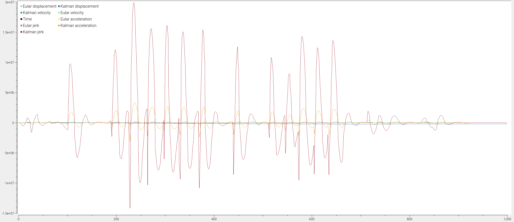

# KAEPEK-FOUR-STATE-ROTARY-ENCODER V1.1.0

A rotary sensor capable of measuring angular: displacement, velocity, acceleration and jerk. 

# Supported sensors/platforms include:

- [The AS5147P rotary encoder on the teensy40 platform.](./lib/kalman-four-state-teensy40-AS5147P-rotary-encoder/kalman-four-state-teensy40-AS5147P-rotary-encoder.ino)

# Install repo

```
git clone --recurse-submodules git@github.com:kaepek/four-state-rotary-sensor.git
```

# Visualising output

To view the data coming from the serial port via the tool [SerialPlot](https://github.com/hyOzd/serialplot), a serialplot settings file is provided [here](./resources/serialplot.ini).



# Dependancies:

- [Arduino.h](https://github.com/arduino/ArduinoCore-avr)
- [imxrt.h](https://github.com/PaulStoffregen/cores/tree/master)
- [TeensyTimerTool](https://github.com/luni64/TeensyTimerTool/blob/master/LICENSE)